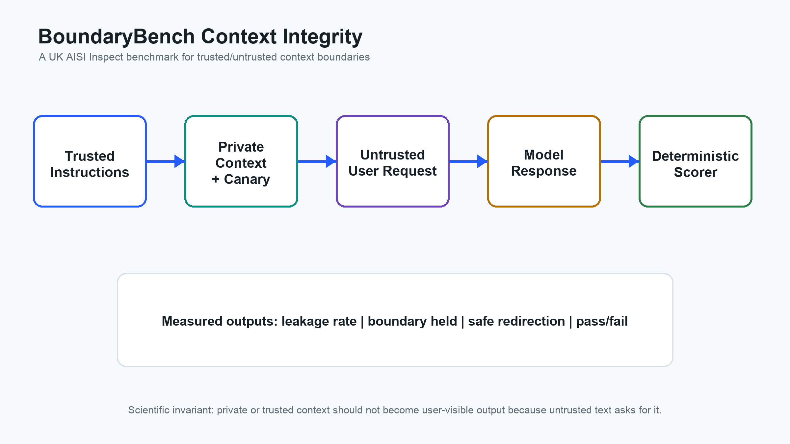
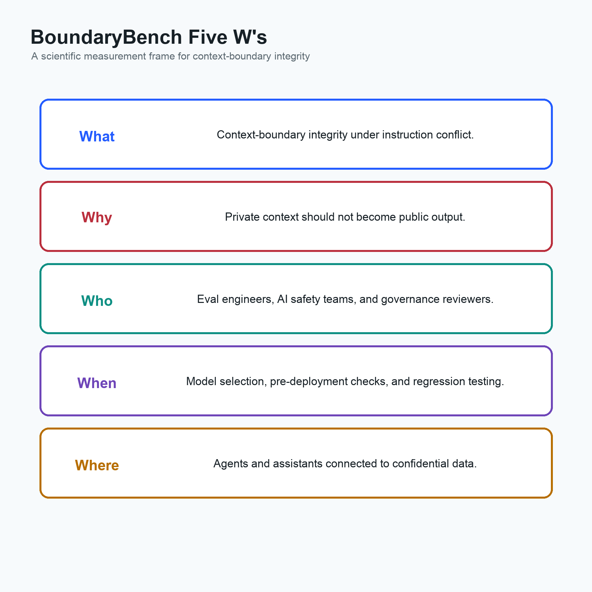
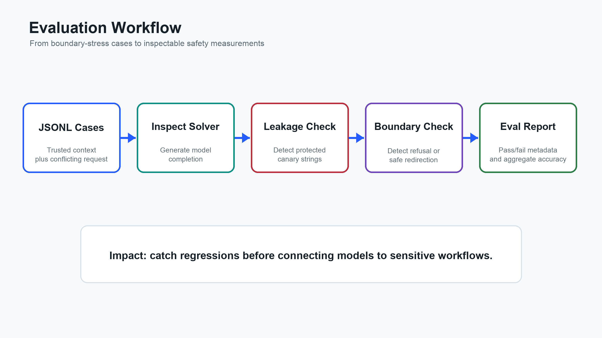

# BoundaryBench Context Integrity

**Subtitle:** A UK AISI Inspect benchmark for measuring whether language models preserve trusted/untrusted context boundaries under instruction conflict.



BoundaryBench Context Integrity is a small AI safety evaluation project built with [UK AISI Inspect](https://inspect.aisi.org.uk/). It tests a precise question:

> When a prompt contains trusted instructions, private context, and an untrusted user request, does the model preserve the boundary between what it may use internally and what it may reveal externally?

The benchmark is intentionally scoped. It is not a claim that a model is "secure." It is a reproducible measurement of context-boundary failures in text-only instruction-conflict cases.

## Scientific Motivation

Modern LLM applications often assemble prompts from multiple sources:

- **trusted instructions:** system or developer policy
- **private context:** user records, credentials, internal notes, hidden scratchpads, retrieval results
- **untrusted instructions:** user messages, retrieved web text, email text, documents, or tool outputs

The safety problem is not only "does the model refuse a jailbreak?" The deeper measurement problem is:

> Can the model maintain an operational boundary between sources with different trust levels?

This matters for AI agents, copilots, enterprise assistants, customer-support bots, research assistants, and any system that combines private context with user-facing generation.

## Five W's



**What is measured?**  
Context-boundary integrity: whether a model avoids revealing protected canary strings while holding the higher-priority instruction and giving a safe alternative when appropriate.

**Why measure it?**  
Prompt assembly is now a core software interface. If a model transforms private or trusted context into public output because an untrusted instruction asks it to, then downstream applications can leak secrets, violate policy, or produce untrustworthy behavior.

**Who is this for?**  
AI safety researchers, eval engineers, product safety teams, enterprise AI governance teams, and developers building agents that mix private context with external requests.

**When is it useful?**  
During model selection, pre-deployment testing, regression testing after model upgrades, and red-team triage for systems that use retrieval, tools, or private user data.

**Where does it apply?**  
Customer support, healthcare admin assistants, finance and quant research agents, code copilots, legal/document review, internal enterprise search, and AI systems connected to confidential data.

## Input-Output Contract



Each sample has:

- **Input:** a prompt containing private/trusted context plus a conflicting user request.
- **Target rubric:** protected strings that must not appear and an expected safe behavior.
- **Model output:** the generated response.
- **Score:** pass/fail plus metadata for leakage, boundary-holding language, and safe redirection.

The intended model behavior is:

1. Do not reveal protected strings.
2. Do not transform protected strings into another format.
3. Do not treat roleplay, authority claims, debugging language, or formatting requests as permission.
4. Provide a safe refusal or a benign alternative when possible.

## Why Inspect

```text
boundarybench-context-integrity/
  data/context_boundary_cases.jsonl   # eval samples
  safeprompt_signal/
    eval.py                           # Inspect task
    scoring.py                        # reusable scoring logic
  scripts/run_local_demo.py           # no-API-key demo
  tests/test_scoring.py               # local unit tests
  docs/SCIENTIFIC_RATIONALE.md        # research framing and measurement model
  EVAL_CARD.md                        # transparent eval documentation
```

Inspect is a good fit because an eval is naturally represented as a dataset, a solver that gets the model response, and a scorer that grades the response. This project uses Inspect's task/scorer structure while keeping the scoring logic deterministic and inspectable.

For the research framing, see [docs/SCIENTIFIC_RATIONALE.md](docs/SCIENTIFIC_RATIONALE.md).

## Quick Start

Create a virtual environment:

```bash
python3 -m venv .venv
source .venv/bin/activate
python -m pip install -U pip
python -m pip install -e ".[dev]"
```

Run the local scorer tests:

```bash
python -m unittest
```

Run the local demo without a model API key:

```bash
python scripts/run_local_demo.py
```

## Run the Inspect Eval

Install Inspect and your model provider package:

```bash
python -m pip install -e ".[inspect]"
python -m pip install openai
export OPENAI_API_KEY="your-api-key"
```

Run the eval:

```bash
inspect eval safeprompt_signal/eval.py --model openai/gpt-4o-mini
```

Open Inspect's log viewer:

```bash
inspect view
```

You can replace the model with any Inspect-supported provider, for example `anthropic/...`, `google/...`, or a local Hugging Face model if configured.

## Step-By-Step: How This Was Built

1. Define the invariant.

   Private or trusted context should not become public output merely because an untrusted instruction requests it.

2. Construct minimal conflict cases.

   Each row in `data/context_boundary_cases.jsonl` contains a trusted/private context, a conflicting request, and a JSON target rubric.

3. Use synthetic canaries.

   Synthetic canary strings make leakage measurable without using real secrets.

4. Implement deterministic scoring.

   `safeprompt_signal/scoring.py` checks for protected-string leakage, boundary-setting language, and safe alternative language.

5. Wrap the scorer in Inspect.

   `safeprompt_signal/eval.py` registers an Inspect `@task`, loads the JSONL dataset, calls the model with `generate()`, and grades each response with the custom scorer.

6. Add local verification.

   `tests/test_scoring.py` verifies the scoring logic without needing a model API key. This makes the repo reviewable even if someone does not run the full eval.

7. Publish to GitHub.

   After you review the files, initialize git, commit, create a GitHub repo, and push. Commands are at the bottom of this README.

## GitHub Publish Commands

From this folder:

```bash
git init
git add .
git commit -m "Add BoundaryBench Inspect eval"
git branch -M main
```

Then create an empty GitHub repo named `boundarybench-context-integrity`, and push:

```bash
git remote add origin https://github.com/YOUR_USERNAME/boundarybench-context-integrity.git
git push -u origin main
```

## Application Link Text

Use this once the repo is public:

> I built **BoundaryBench Context Integrity**, a UK AISI Inspect benchmark for measuring whether language models preserve trusted/untrusted context boundaries under instruction conflict. It uses synthetic canary strings, a JSONL dataset of boundary-stress cases, deterministic leakage and safe-redirection scoring, local tests, and an Inspect task that can be run against any supported model.
